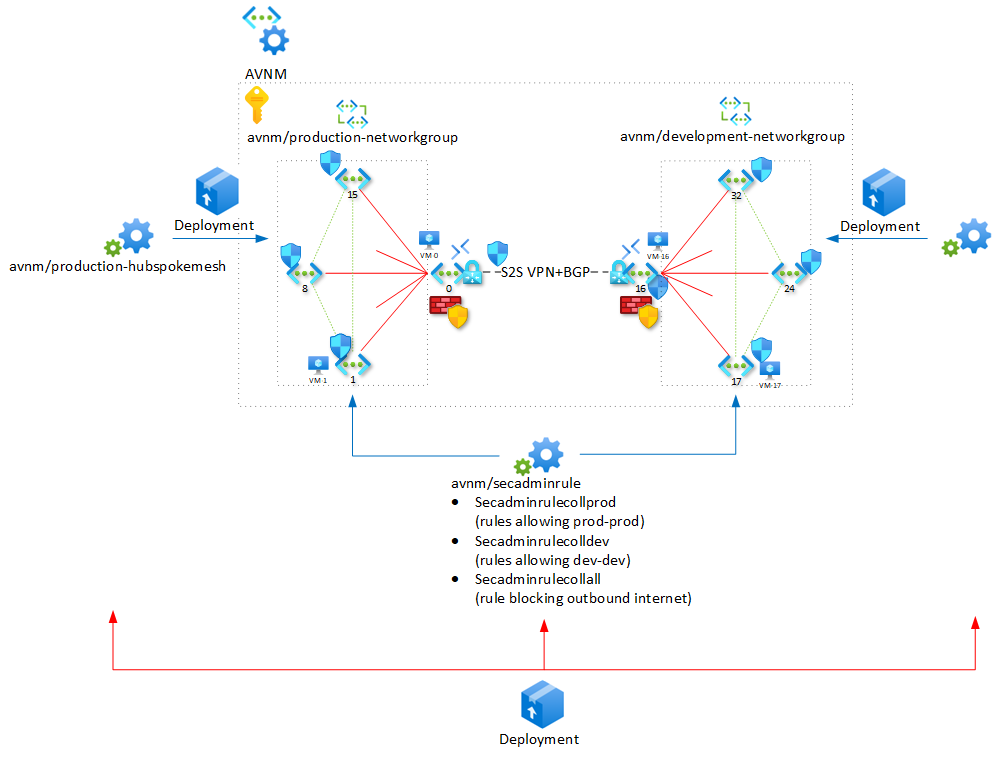

# AVNM Demo Lab

This is a lab to demonstrate and experiment with [Azure Virtual Network Manager](https://learn.microsoft.com/en-us/azure/virtual-network-manager/overview).

## Components
The lab consists of following elements:
- A set of VNETs.
  - Quantity is controlled by the `copies` parameter, (default: 20).
- Windows Server VMs in VNETs 0, 1, 2, and `copies`/2 (default: 10), `copies`/2+1 (11), `copies`/2+2 (12).
  - Each VM runs a basic webpage that returns the VM name.
- Bastion Hosts in VNETs 0 and `copies/2` (10).
- AVNM instance `avnm` scoped to the subscription.
- Network Groups
  -  `production-networkgroup` contains VNETs 1 - `copies`/2-1 (9).
  -  `development-networkgroup` contains `copies`/2+1 (11) - `copies` (20).
- Network Configurations `production-hubspokemesh` and `development-hubspokemesh`, implementing a Hub&spoke with DirectConnectivity topology for the respective Network Groups.
- Security Configuration `secadminrule`,
  - Rule Collections `secadminrulecoll-production` and `secadminrulecoll-development`, each containing rules allowing communication within the respective Network Groups only (i.e. Production can only send traffic to Production, not to Development)
  - Rule Collection `no-internet` blocking outbound traffic from both Network Groups.
- VNET Gateways in VNETs 0 and `copies/2` (10) (the hubs of the Hub&spoke configurations for both Network Groups), with a VPN tunnel with BGP between them.



## Lab Deployment

Log in to Azure Cloud Shell at https://shell.azure.com/ and select Bash.

Ensure Azure CLI and extensions are up to date:
  
`az upgrade --yes`
  
If necessary select your target subscription:
  
`az account set --subscription <Name or ID of subscription>`
  
Clone the  GitHub repository:

`git clone https://github.com/mddazure/avnm-demo`

Change directory:

`cd ./avnm-demo`

Create a new resource group:

`az group create --name {rgname} --location {location}`

Deploy the bicep template:

`az deployment group create -g {rgname} --template-file main-hub-s2s.bicep`

## AVNM Configuration Deployment
The Network- and Security Configurations need to be deployed to take effect. This may be achieved from the Network Manager page in the portal, under Settings -> Deployments -> Deploy configurations. 
Select Configurations to deploy and target region:


And Deploy:


## Explore

### VM Effective Routes

List the effective routes for the VM in Hub VNET 0:

`az network nic show-effective-route-table --name VMNic-0 -g {rgname} -o table`

```Source                 State    Address Prefix    Next Hop Type          Next Hop IP
---------------------  -------  ----------------  ---------------------  -------------
Default                Active   10.0.0.0/24       VnetLocal
Default                Active   10.0.1.0/24       VNetPeering
Default                Active   10.0.2.0/24       VNetPeering
Default                Active   10.0.3.0/24       VNetPeering
Default                Active   10.0.4.0/24       VNetPeering
Default                Active   10.0.5.0/24       VNetPeering
Default                Active   10.0.6.0/24       VNetPeering
Default                Active   10.0.7.0/24       VNetPeering
Default                Active   10.0.8.0/24       VNetPeering
Default                Active   10.0.9.0/24       VNetPeering
VirtualNetworkGateway  Active   10.0.11.0/24      VirtualNetworkGateway  20.13.72.192
VirtualNetworkGateway  Active   10.0.10.158/32    VirtualNetworkGateway  20.13.72.192
VirtualNetworkGateway  Active   10.0.10.0/24      VirtualNetworkGateway  20.13.72.192
VirtualNetworkGateway  Active   10.0.12.0/24      VirtualNetworkGateway  20.13.72.192
VirtualNetworkGateway  Active   10.0.13.0/24      VirtualNetworkGateway  20.13.72.192
VirtualNetworkGateway  Active   10.0.15.0/24      VirtualNetworkGateway  20.13.72.192
VirtualNetworkGateway  Active   10.0.14.0/24      VirtualNetworkGateway  20.13.72.192
VirtualNetworkGateway  Active   10.0.16.0/24      VirtualNetworkGateway  20.13.72.192
VirtualNetworkGateway  Active   10.0.17.0/24      VirtualNetworkGateway  20.13.72.192
VirtualNetworkGateway  Active   10.0.18.0/24      VirtualNetworkGateway  20.13.72.192
VirtualNetworkGateway  Active   10.0.19.0/24      VirtualNetworkGateway  20.13.72.192
Default                Active   0.0.0.0/0         Internet
```
Observe routes are present to all peered (spoke) VNETs, and to all VNETs in the other network groups via the VNET Gateway:

List the effective routes for the VM in Spoke VNET 1:

`az network nic show-effective-route-table --name VMNic-1 -g {rgname} -o table`

```
Source                 State    Address Prefix                                                                                   Next Hop Type          Next Hop IP
---------------------  -------  -----------------------------------------------------------------------------------------------  ---------------------  -------------
Default                Active   10.0.1.0/24                                                                                      VnetLocal
Default                Active   10.0.0.0/24                                                                                      VNetPeering
Default                Active   10.0.9.0/24 10.0.8.0/24 10.0.7.0/24 10.0.6.0/24 10.0.5.0/24 10.0.4.0/24 10.0.3.0/24 10.0.2.0/24  ConnectedGroup
VirtualNetworkGateway  Active   10.0.11.0/24                                                                                     VirtualNetworkGateway  20.13.72.192
VirtualNetworkGateway  Active   10.0.10.158/32                                                                                   VirtualNetworkGateway  20.13.72.192
VirtualNetworkGateway  Active   10.0.10.0/24                                                                                     VirtualNetworkGateway  20.13.72.192
VirtualNetworkGateway  Active   10.0.12.0/24                                                                                     VirtualNetworkGateway  20.13.72.192
VirtualNetworkGateway  Active   10.0.13.0/24                                                                                     VirtualNetworkGateway  20.13.72.192
VirtualNetworkGateway  Active   10.0.15.0/24                                                                                     VirtualNetworkGateway  20.13.72.192
VirtualNetworkGateway  Active   10.0.14.0/24                                                                                     VirtualNetworkGateway  20.13.72.192
VirtualNetworkGateway  Active   10.0.16.0/24                                                                                     VirtualNetworkGateway  20.13.72.192
VirtualNetworkGateway  Active   10.0.17.0/24                                                                                     VirtualNetworkGateway  20.13.72.192
VirtualNetworkGateway  Active   10.0.18.0/24                                                                                     VirtualNetworkGateway  20.13.72.192
VirtualNetworkGateway  Active   10.0.19.0/24                                                                                     VirtualNetworkGateway  20.13.72.192
Default                Active   0.0.0.0/0                                                                                        Internet

```
Observe single entry for all VNETs in the Network Group with Next Hop Type ConnectedGroup, and routes for all VNETs in the other Network Group via the VNET Gateway in the Hub.

### Effective Security Rules

Listing Effective security rules in the portal, on a VM NIC in one of the Network Groups, shows separate entries for the NSG attached to the subnet and the Admin Rules programmed by AVNM.

#### NSG Rules


#### Security Admin Rules


### Connectivity
Use Bastion Host in a Hub VNET to log in to the VM in the Hub.

Use `curl 10.0.{spoke number}.4` to verify that it is possible to connect to VMs in Spokes in the same Network Group, but not in the other Group. Verify that there is no internet access from the VM. 

Routes to other VMs exist, but outbound access is restricted by the Security Admin Rules.

Remove the Security Admin Deployment.

Verify that the VM can now reach VMs in the other Group, and has internet access.

 


